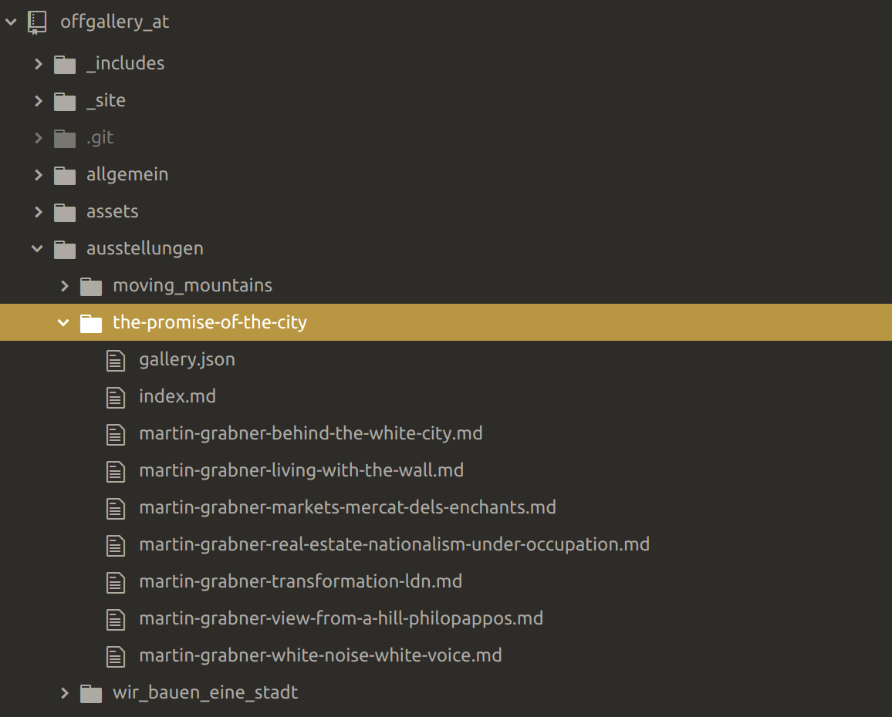
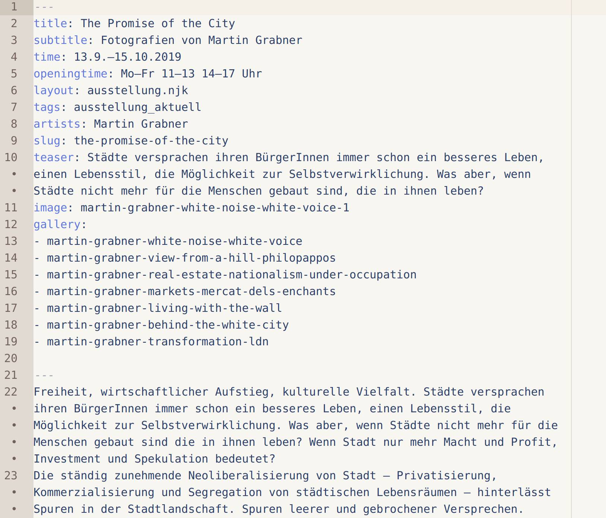

# Was sind Static Site Generators


##

- Website wird lokal generiert
- Statische Auslieferung
- Verbindung mit Microservices

##

- Markdown und andere Textinhaltsformate
- Template-Sprachen

## Vorteile

- Geschwindigkeit
- Leichte Entwicklung

## Jekyll und Hugo

- Jekyll: Erster erfolgreicher SSG, enge Verbindung zu GitHub
- Hugo: Hohe Performanz und Flexibilität

# Beispielprojekt

##

Repository: <https://github.com/heinzwittenbrink/offgallery_at>
Daten der Website: <https://github.com/heinzwittenbrink/offgallery_at/tree/master/_site>
Testversion: <https://silly-hypatia-0d5c1f.netlify.com/>

## eleventy

- [Eleventy](https://www.11ty.io/ "Eleventy")
- Basis: JavaScript, NodeJS
- Unterstützt viele Templatesprachen

## Installation

- [Getting Started—Eleventy](https://www.11ty.io/docs/getting-started/ "Getting Started—Eleventy")
- Lokale oder globale Installation

## Generieren der Site

##

Beispiel: Starten von eleventy mit lokalem Server

```bash
eleventy --serve

```

## Ordnerstruktur

{ width=70% }

## Content als Markdown

```markdown
---
layout: picture_desc.njk
tags: thepromiseofthecity
artist: Martin Grabner
rights: Martin Grabner
gallery:
- martin-grabner-transformation-ldn
title: Transformation LDN
author: Martin Grabner
---


Londons Straßen nahe der City harren der unvermeidlichen Gentrifizierung. Inzwischen steht in dieser Baulücke in der Clerkenwell Road ein mehrgeschoßiges Geschäftshaus.

```

## Frontmatter/tags

{ width=70% }

## Directory data

```json
{
  "layout" : "article.njk",
  "changefreq": "monthly",
  "priority": "0.9"
}
```

## RSS-Feed

```markdown
---
permalink: feed.xml
eleventyExcludeFromCollections: true

metadata:
  title: off_gallery.at
  url: https://offgallery.at/
  author:
    name: Anastasija Georgi, Erika Petrić, Heinz Wittenbrink
    email: info@offgallery.at
  feed:
    subtitle: offgallery_graz - Nachrichten und Einladungen
    filename: feed.xml
    path: feed/feed.xml
    url: https://offgallery.at/feed.xml
    id: https://offgallery.at/
---
<?xml version="1.0" encoding="utf-8"?>
<feed xmlns="http://www.w3.org/2005/Atom">
  <title>{{ metadata.title }}</title>
  <subtitle>{{ metadata.feed.subtitle }}</subtitle>
  <link href="{{ metadata.feed.url }}" rel="self"/>
  <link href="{{ metadata.url }}"/>

```

## Sitemap

```markdown
---
permalink: /sitemap.xml
eleventyExcludeFromCollections: true
---
<?xml version="1.0" encoding="utf-8"?>
<urlset xmlns="http://www.sitemaps.org/schemas/sitemap/0.9">

  {{ page.url | url | absoluteUrl(metadata.url) }}
  <url>
    <loc>{{ absoluteUrl }}</loc>
    <lastmod>{{ page.date | htmlDateString }}</lastmod>
  </url>

</urlset>

```

# SSG-Ökosystem

## Netlify

## Forestry

# Fragen

## Unterstützen SSGs das Prinzip *Content First* besser als andere CMS?

## Welchen Support bieten sie für strukturierte Daten?

# Aufgaben

##
1. Andere SSGs testen: Jekyll, Hugo
2. Konzept einer Inhaltsstruktur für oer.fh-joanneum.at/contentstrategy entwickeln
    - Welche collections sind interessant?
    - Welche Metadaten sind wichtig?
